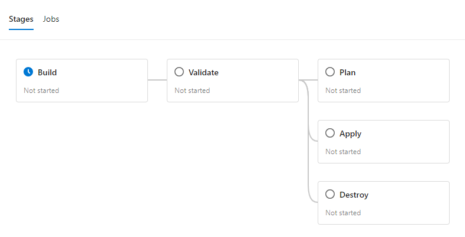

# Sandpit_AZ_WikiApp
Azure WebApp and Database (TODO) for hosting a python flask wiki app

## Pipeline
Azure DevOps pipeline templates can be found in the templates directory.



Each pipeline run is divided into three stages: 'Build', Validate', and 'Plan|Apply|Destroy'. These are outlined below. Conditions and dependencies are used on each stage to ensure the Build and Validate stages run successfully. For example:
```yml
  ...
  stage: Apply
  condition: and(succeeded(), eq('${{ parameters.action }}', 'Apply')) 
  dependsOn: Validate
  ...
```
Each of the stages contain a single job, Tasks within a single job run on the same agent. This simplifies file-sharing between tasks.


### Build
- Generates dynamic run-time tags
- passes ADO Library variables to bicep, using the `qetza.replacetokens.replacetokens-task`.replacetokens@6' task.
- Publishes the repository as an artifact for use in later stages.

### Plan
- bicep has a 'what-if' mode that can be used to perform a dry-run/plan of the the deployment. An example output is: TODO
- However, the `AzureResourceManagerTemplateDeployment@3` pipeline task does not currently offer a 'what-if' option, meaning this must be scripted using the Azure CLI.
- First, the `AzureResourceManagerTemplateDeployment@3` task is used to ensure the resource group exists.
- A 'What-if' plan is then ran using:
```bash
az deployment group what-if --resource-group [RESOURCE_GROUP] ....
```

### Validate / Apply / Destroy
- These stages share the same template.
- Downloads the artifact from the 'build' stage
-  Perform the relevant action using the `AzureResourceManagerTemplateDeployment@3` task, depedning on the 'deploymentMode' parameter. 
   -  Since resource groups must be applied at the subscription scope, and are a depenency of other resources, the resourcegroup is split into it's own bicep code, and deployed/validated first.
   -  The other resources are then deployed to the resource group scope scope.
-  when applying, the deploymentMode is set to `Incremental` rather than complete, to prevent non-bicep-managed resources/config being destroyed. 
  - TODO: Destroy 
